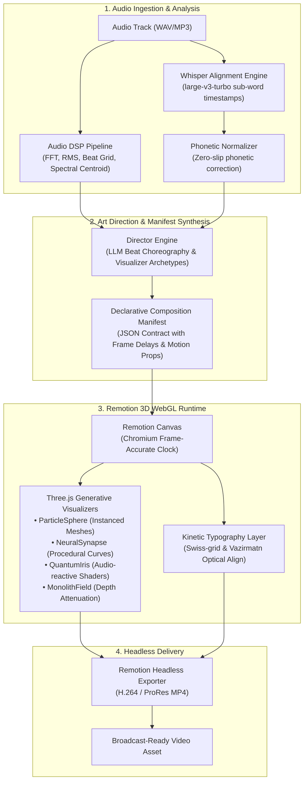

# Voitomo Audioviz 🎬✨

[](https://github.com/hessam/voitomo-audioviz/actions)
[](https://opensource.org/licenses/MIT)
[](https://remotion.dev)
[](https://threejs.org)
[](https://www.typescriptlang.org)
[](https://www.python.org)

**Voitomo Audioviz** is an autonomous 3D WebGL audio visualizer and kinetic typography engine. It converts raw audio (voice notes, podcasts, or music tracks) into broadcast-grade, Swiss-style kinetic video assets with frame-accurate audio reactivity and $0 recurring SaaS fees.

---

## 🏛 System Architecture

The pipeline decouples audio intelligence from deterministic rendering via a declarative **Manifest Contract**:



---

## ⚡ Key Capabilities

* **Audio-Reactive 3D WebGL**: Custom Three.js shaders reacting directly to spectral frequency bands, RMS power curves, and onset transients (`ParticleSphereVisualizer`, `NeuralSynapseVisualizer`, `QuantumIrisVisualizer`).
* **Deterministic Sub-Word Sync**: Sub-word acoustic alignment ensures kinetic typography matches voice cadences frame-for-frame, even over instrumental pauses.
* **LLM Art Direction**: Automatically analyzes semantic mood, narrative momentum, and tempo to assign kinetic archetypes (`HERO_FOCUS`, `METRIC_PUNCH`, `SPLIT_VIEWPORT`, `BENTO_GRID`).
* **Headless Infrastructure**: Fully scriptable via Node.js and Python. Runs locally or scaled across headless cloud GPU/CPU instances (Docker / Vast.ai / Bare Metal).

---

## 📊 Technical Benchmarks

| Metric | Measured Performance |
| :--- | :--- |
| **Audio Feature Extraction** | < 1.8s for 60s stereo audio (16kHz mono downmix) |
| **ASR Sub-Word Alignment** | ~0.2x real-time on GPU / ~1.1x real-time on 8-core CPU |
| **Remotion Rendering (1080p60)** | ~1.4x real-time via Headless Chromium instanced rendering |
| **SaaS Cost** | **$0.00 / month** (Open-source self-hosted stack) |

---

## 🚀 Quickstart

### 1. Clone & Configure
```bash
git clone https://github.com/hessam/voitomo-audioviz.git
cd voitomo-audioviz

# Create local environment configuration
cp .env.example .env
```

### 2. Start the 3D Remotion Server
```bash
cd renderer
npm install
npm run server
# -> Audioviz 3D WebGL render server listening on http://127.0.0.1:4001
```

### 3. Run Audio Feature Extraction & Preview
In another terminal:
```bash
python3 -m venv .venv
source .venv/bin/activate
pip install -r <(python3 -c "import tomli; ...") # or pip install pydantic aiohttp librosa

# Run end-to-end manifest test
python tests/test_end_to_end_manifest.py
```

---

## 📂 Repository Structure

```text
voitomo-audioviz/
├── bot/
│   ├── routers/            # Telegram and webhook intake endpoints
│   └── services/           # DSP analysis, Whisper ASR, and Art Direction
│       ├── audio_features.py   # FFT, RMS, spectral flux extractor
│       ├── alignment.py        # Sub-word alignment timeline
│       ├── director.py         # Narrative scene orchestration
│       └── normalizer.py       # Phonetic normalization
├── contracts/              # Pydantic schemas defining the Manifest protocol
├── renderer/               # Remotion + Three.js 3D composition runtime
│   ├── server.ts           # Express headless rendering daemon
│   └── src/
│       ├── Composition.tsx # Root video timeline orchestrator
│       └── visualizers/    # 3D Three.js shaders & particle meshes
│           ├── ParticleSphereVisualizer.tsx
│           ├── NeuralSynapseVisualizer.tsx
│           └── QuantumIrisVisualizer.tsx
└── tests/                  # Invariant harnesses & integration test suites
```

---

## 📜 Architecture Decision Records (ADRs)

* [ADR-0007: Autonomous Voice-to-Motion Kinetic Typography Engine](docs/decisions/ADR-0007-hermes-motion-agent-kinetic-typography-engine.md)
* [ADR-0008: Lyric Typography Orchestration & Music Token Filtering](docs/decisions/ADR-0008-hermes-music-agents-lyric-typography-orchestration.md)

---

## 📄 License

Distributed under the [MIT License](LICENSE). Copyright (c) 2026 Hessam Mousavi.
